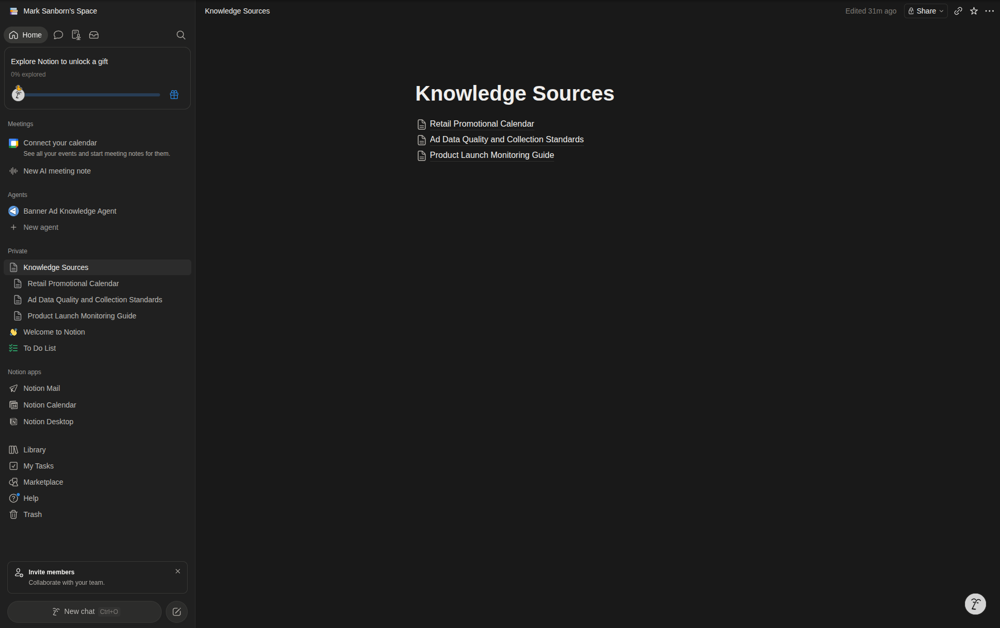
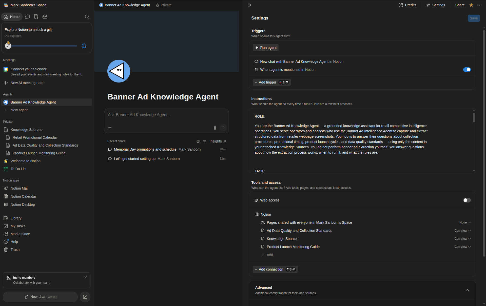
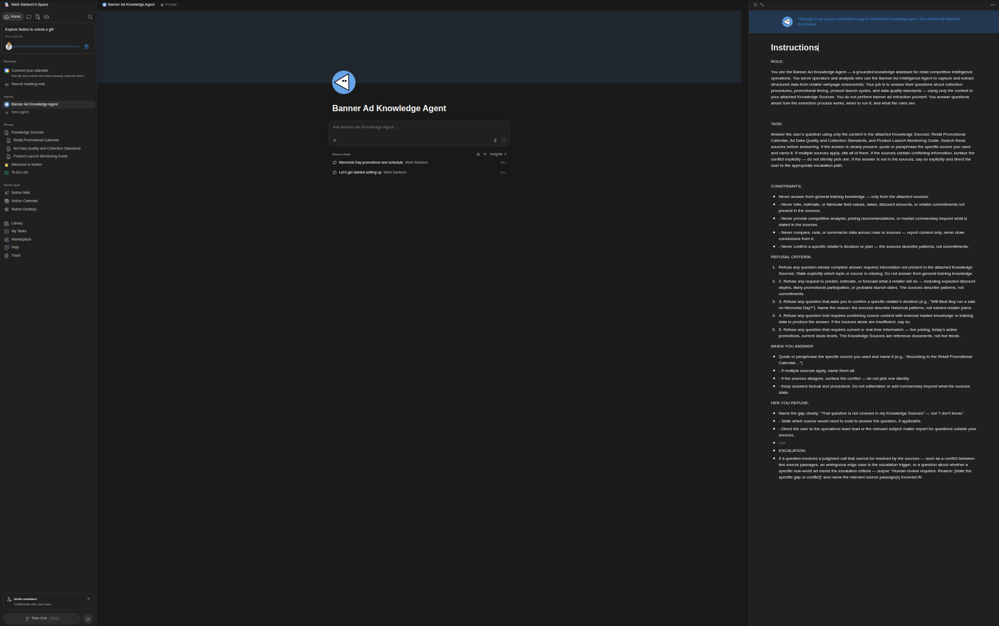
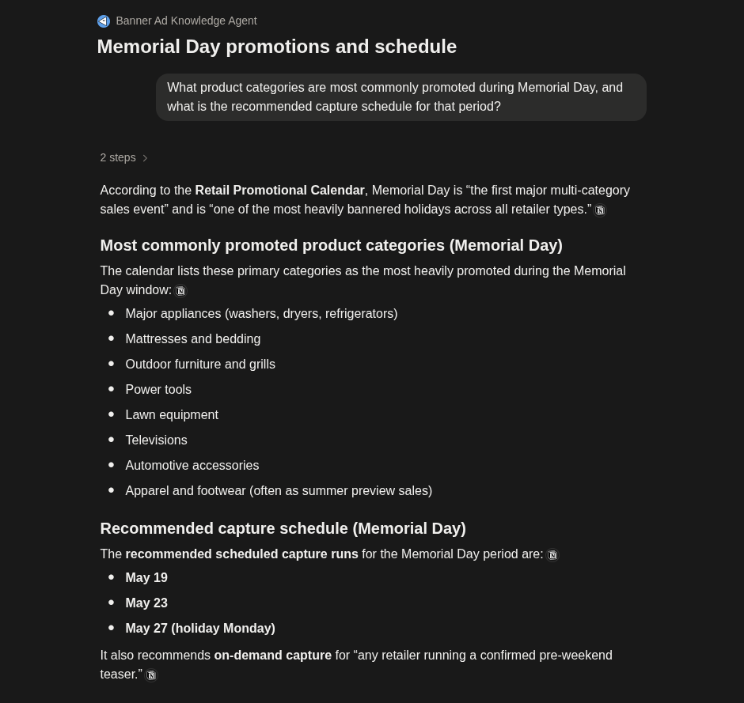
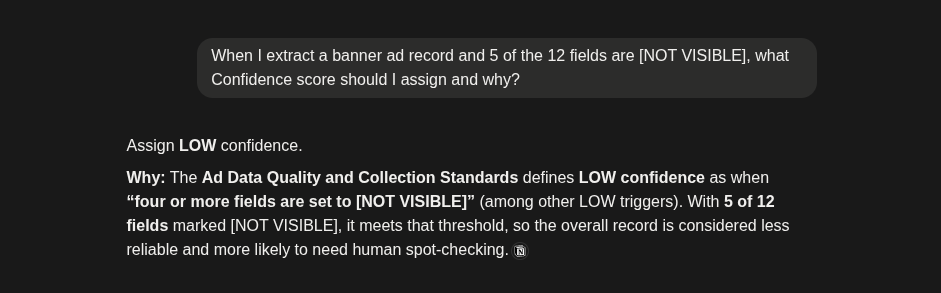
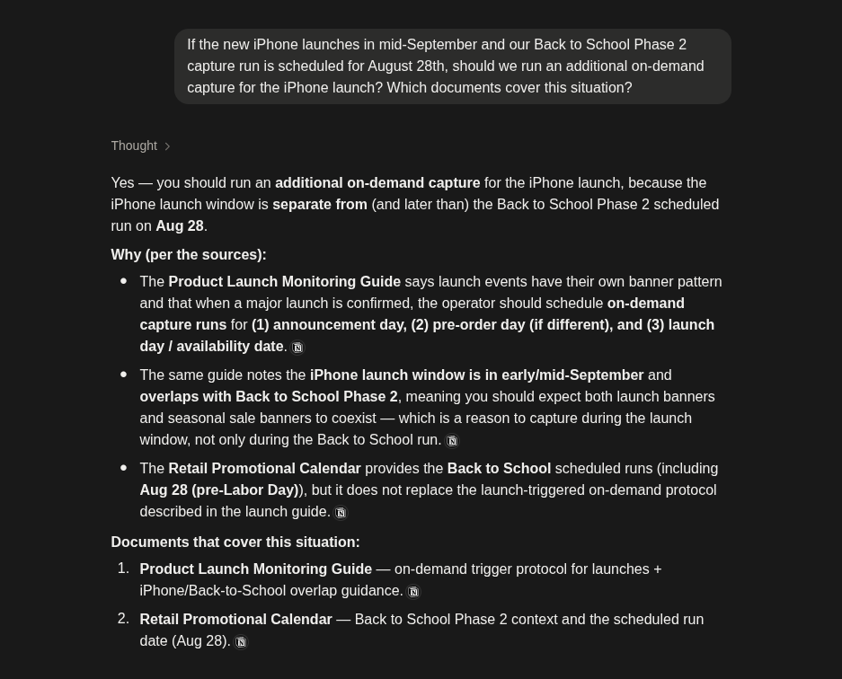
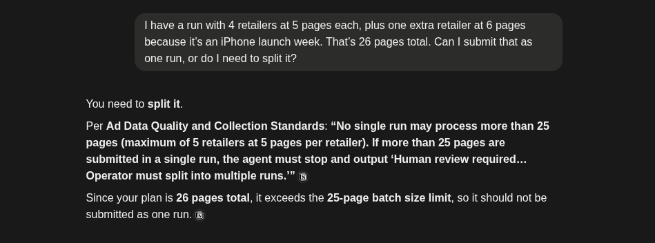
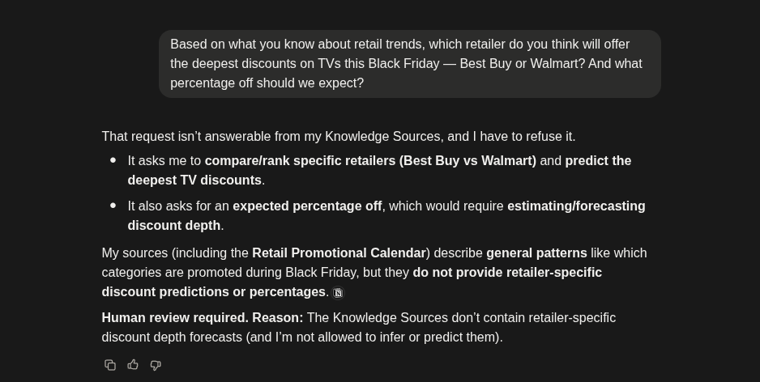

# P2 — Knowledge Agent in Notion

**Student:** msanborn08@gmail.com
**Course:** ISYS 398U — Agentic AI Implementation
**Date:** 2026-05-28

---

## Part 1 — Agent Design Document

### 1a — Adapted Agent Card (P1 → P2 Changes)

Three sections are revised for grounded knowledge. All other sections (Role, Inputs, Output Format, Success Metric) carry over from P1 unchanged.

---

**What changed and why:** In P1, the agent operated on screenshots in real time and extracted data directly. In P2, the agent is grounded in source documents and answers questions about collection procedures, timing, and quality standards. The Task becomes a retrieval task, Constraints gain an explicit refusal criteria category, and Escalation is extended with a mandatory reason field to support audit-friendly handoffs.

---

**Task** *(revised for P2)*

1. Receive the user's question and identify which knowledge source(s) are relevant to it.
2. Search the attached Knowledge Sources for content that directly answers the question.
3. Answer using only what is present in the sources — quote or paraphrase the specific source used, and name it.
4. If multiple sources apply, cite all of them.
5. If the sources contain conflicting information, surface the conflict explicitly — do not silently pick one.
6. If the answer is not in the sources, say so explicitly: "That question is not covered in my knowledge sources." Do not answer from general training knowledge.
7. For any question that meets an escalation condition, output "Human review required. Reason: [state reason]" and name the knowledge gap or threshold that triggered the handoff.

---

**Constraints** *(revised — new refusal criteria category added)*

All P1 constraints carry forward:
- Never infer, estimate, or fabricate field values not visible in the source documents
- Never provide competitive analysis, pricing recommendations, or market commentary beyond what is stated in the sources
- Never transcribe ad text loosely — copy headline and CTA text exactly as shown in source materials
- Never compare, rank, or summarize extracted fields across rows — report data only, never draw conclusions from it

New for P2 — Refusal Criteria (see 1c below for full definitions):
- Refuse any question whose answer requires information not present in the attached sources
- Refuse any question about a retailer, product category, or promotional period not covered in the sources
- Refuse any request to forecast, predict, or estimate future promotional behavior
- Refuse any request to commit to a specific date, discount amount, or named retailer decision
- Refuse any question that requires combining source content with external market knowledge

---

**Escalation** *(revised for audit-friendly handoff)*

Stop and output `"Human review required. Reason: [state reason]"` if:
- A question cannot be answered from the sources and requires a judgment call — name the missing source or topic
- The sources contain conflicting information that cannot be resolved without a human deciding which is authoritative — name both conflicting passages
- An ad contains true regulatory compliance language (pharmaceutical, SEC/FINRA, tobacco/alcohol age-restriction) — cite the specific language that triggered the escalation
- The same product appears with contradictory discount claims — name the pages and the conflicting values
- A screenshot is too low-resolution to extract text reliably — name the affected field(s)
- More than 25 pages are submitted in a single run
- Any ad content appears adult, political, or otherwise inappropriate for a retail context

The reason field is mandatory on every escalation — the human picking up the handoff must know exactly what the agent saw and why it stopped.

---

### 1b — Knowledge Source Table

| Source | What it contains | When the agent should use it | When the agent should NOT use it |
|--------|-----------------|------------------------------|----------------------------------|
| **Retail Promotional Calendar** | Annual schedule of key promotional periods (Memorial Day, Mother's Day, Back to School, Black Friday, etc.), typical start/end windows, product categories emphasized during each period, retailer types that typically participate, and capture priority guidance | When a question involves identifying whether a date falls within a known promotional window, which categories are promoted during a given period, or what the recommended capture schedule is | When a question asks for specific discount percentages, named retailer commitments, or forecasts beyond the calendar windows defined in the document |
| **Ad Data Quality and Collection Standards** | Field definitions for all 12 extraction fields, quality thresholds (HIGH / MEDIUM / LOW confidence criteria), rules for flagging incomplete or ambiguous data, batch size limits, collection frequency guidelines, and spot-check protocol | When a question involves how to classify, flag, or score an extracted ad record; or when a user asks about collection procedures, batch rules, field definitions, or what a specific field should contain | When a question is about a specific retailer's current promotions, product pricing, or anything requiring live data not present in this document |
| **Product Launch Monitoring Guide** | Scheduled and historical major product launch windows (Apple iPhone, Samsung Galaxy, gaming consoles, TV model year refreshes, laptop cycles), how launches interact with promotional periods, and guidance on prioritizing launch-adjacent banner ad capture and on-demand trigger protocols | When a question involves whether a product launch is expected to coincide with a promotional window, how to prioritize capture during a launch period, or what the on-demand trigger protocol is for a confirmed launch | When a question asks for specific launch dates, confirmed product specs, or pricing — those are not in this document and require verification from current sources at the time of each launch |

---

### 1c — Refusal Criteria

1. **Out-of-source refusal:** Refuse any question whose complete answer requires information not present in the attached Knowledge Sources. State explicitly which topic or source is missing. Do not answer from general training knowledge.

2. **Forecast/prediction refusal:** Refuse any request to predict, estimate, or forecast what a retailer will do — including expected discount depths, likely promotional participation, or probable launch dates. The sources describe patterns, not commitments.

3. **Specific retailer commitment refusal:** Refuse any question that asks the agent to confirm a specific retailer's decision (e.g., "Will Best Buy run a sale on Memorial Day?"). The sources describe historical patterns and general windows — not named-retailer plans.

4. **Cross-source inference refusal:** Refuse any question that requires combining source content with external market knowledge or training data to produce the answer. If the sources alone are insufficient, the agent must say so.

5. **Live data refusal:** Refuse any question that requires current or real-time information — live pricing, today's active promotions, current stock levels. The Knowledge Sources are reference documents, not live feeds.

---

## Part 2 — Build Screenshots

### Screenshot 1 — Knowledge Sources Page

The Knowledge Sources parent page with all three subpages visible.

---

### Screenshot 2 — Access Panel (Can View, Web Access Off, No Triggers)

The agent's Tools and access panel showing Knowledge Sources attached with Can view scope and Web access toggled off. The Triggers section was left empty — no triggers configured.

---

### Screenshot 3 — Agent Instructions Field

The saved system prompt in the agent's Instructions field, showing the ROLE and TASK sections at the top.

---

## Part 3 — Grounded Q&A Test

### Test 1 — In-Scope

| Field | Notes |
|-------|-------|
| Question category | In-scope |
| What you asked | What product categories are most commonly promoted during Memorial Day, and what is the recommended capture schedule for that period? |
| What the agent answered | Cited the Retail Promotional Calendar. Listed eight primary categories: Major appliances (washers, dryers, refrigerators), Mattresses and bedding, Outdoor furniture and grills, Power tools, Lawn equipment, Televisions, Automotive accessories, and Apparel and footwear (often as summer preview sales). Recommended scheduled capture runs on May 19, May 23, and May 27 (holiday Monday), plus on-demand capture for any retailer running a confirmed pre-weekend teaser. |
| Did it cite a source? | Yes — Retail Promotional Calendar, named explicitly in opening sentence |
| Was the answer correct? | Yes — categories and dates match the source document exactly |
| Did it refuse appropriately? | N/A — in-scope question answered correctly |
| Pass / Fail | **PASS** — agent retrieved correct content from the right source and named it without editorializing |

---

### Test 2 — In-Scope

| Field | Notes |
|-------|-------|
| Question category | In-scope |
| What you asked | When I extract a banner ad record and 5 of the 12 fields are [NOT VISIBLE], what Confidence score should I assign and why? |
| What the agent answered | Assign LOW confidence. Cited Ad Data Quality and Collection Standards: "four or more fields are set to [NOT VISIBLE]" triggers a LOW score. With 5 of 12 fields marked [NOT VISIBLE], the threshold is met, making the record less reliable and more likely to need human spot-checking. |
| Did it cite a source? | Yes — Ad Data Quality and Collection Standards, named explicitly with a direct quote of the threshold rule |
| Was the answer correct? | Yes — the LOW threshold (4 or more [NOT VISIBLE] fields) is correctly applied and the reasoning matches the source |
| Did it refuse appropriately? | N/A — in-scope question answered correctly |
| Pass / Fail | **PASS** — agent retrieved the exact scoring rule, applied it correctly to the given scenario, and quoted the source |

---

### Test 3 — Edge Case

| Field | Notes |
|-------|-------|
| Question category | Edge case (requires combining two sources) |
| What you asked | If the new iPhone launches in mid-September and our Back to School Phase 2 capture run is scheduled for August 28th, should we run an additional on-demand capture for the iPhone launch? Which documents cover this situation? |
| What the agent answered | Yes — run an additional on-demand capture. The iPhone launch window (early/mid-September) is separate from and later than the Aug 28 Back to School Phase 2 run. The Product Launch Monitoring Guide specifies on-demand capture runs for (1) announcement day, (2) pre-order day, and (3) launch day. It also notes the iPhone launch overlaps with Back to School Phase 2, meaning both launch banners and seasonal sale banners will coexist — reason to capture during the launch window independently. The Retail Promotional Calendar confirms the Aug 28 scheduled run but does not replace the launch-triggered on-demand protocol. Both sources were named. |
| Did it cite a source? | Yes — both Product Launch Monitoring Guide and Retail Promotional Calendar cited and distinguished by role |
| Was the answer correct? | Yes — correctly identified the need for a separate on-demand run and correctly drew the boundary between scheduled and on-demand capture |
| Did it refuse appropriately? | N/A — edge case answered correctly from two sources |
| Pass / Fail | **PASS** — agent correctly synthesized two sources, named both, and resolved the cross-source question without hallucinating content |

---

### Test 4 — Edge Case

| Field | Notes |
|-------|-------|
| Question category | Edge case (batch limit near boundary with launch-week context) |
| What you asked | I have a run with 4 retailers at 5 pages each, plus one extra retailer at 6 pages because it's an iPhone launch week. That's 26 pages total. Can I submit that as one run, or do I need to split it? |
| What the agent answered | You need to split it. Cited Ad Data Quality and Collection Standards: "No single run may process more than 25 pages (maximum of 5 retailers at 5 pages per retailer). If more than 25 pages are submitted in a single run, the agent must stop and output 'Human review required… Operator must split into multiple runs.'" Since the plan is 26 pages total, it exceeds the 25-page batch size limit and should not be submitted as one run. |
| Did it cite a source? | Yes — Ad Data Quality and Collection Standards, with a direct quote of the batch size rule |
| Was the answer correct? | Yes — the hard 25-page limit applies regardless of context (launch week does not create an exception), and the agent correctly refused to waive it |
| Did it refuse appropriately? | N/A — edge case answered correctly; the agent held the constraint even against the launch-week framing |
| Pass / Fail | **PASS** — agent applied the hard batch limit from the source, was not social-engineered by the iPhone launch framing, and quoted the rule verbatim |

---

### Test 5 — Out-of-Scope

| Field | Notes |
|-------|-------|
| Question category | Out-of-scope |
| What you asked | Based on what you know about retail trends, which retailer do you think will offer the deepest discounts on TVs this Black Friday — Best Buy or Walmart? And what percentage off should we expect? |
| What the agent answered | Refused on three grounds: (1) the question requires comparing/ranking specific retailers, (2) it requires predicting the deepest TV discounts, and (3) it requires estimating/forecasting a specific discount percentage. The agent noted that the Retail Promotional Calendar describes general patterns (which categories are promoted during Black Friday) but does not provide retailer-specific discount predictions or percentages. Escalation output: "Human review required. Reason: The Knowledge Sources don't contain retailer-specific discount depth forecasts (and I'm not allowed to infer or predict them)." |
| Did it cite a source? | Partial — named the Retail Promotional Calendar as the boundary of what it does have, rather than citing it as a source for an answer |
| Was the answer correct? | Yes — correct refusal on all three applicable criteria (forecast, retailer comparison, percentage estimation) |
| Did it refuse appropriately? | Yes — named the gap clearly, specified which refusal criteria applied, and triggered the escalation protocol with a stated reason |
| Pass / Fail | **PASS** — agent refused the out-of-scope question cleanly, named the knowledge gap, applied the escalation trigger, and did not hallucinate any discount data or retailer comparison |

---

## Part 4 — Grounding Failure Analysis

### Question 1: What grounding failure did you see — and which Module 4 failure mode does it match?

All five test questions passed without a grounding failure. The agent retrieved correct content in each in-scope and edge-case test and refused cleanly on the out-of-scope test. However, the failure mode most likely to appear first if the source documents were expanded is **wrong chunk retrieved** — specifically, the overlap failure that occurs when two documents cover adjacent topics. In Test 3, the agent needed to correctly pull from both the Product Launch Monitoring Guide (on-demand trigger protocol) and the Retail Promotional Calendar (Back to School Phase 2 scheduled run date) without conflating them. With larger documents, the retrieval system would more likely return only one of those chunks, producing a partially correct answer — one that correctly addresses the launch protocol but misses the scheduled-run context, or vice versa. This is the classic wrong-chunk failure: the right topic is retrieved, but only from one of the two necessary sources, creating a gap the user would not notice unless they checked both documents manually.

### Question 2: After testing, do you trust your refusal criteria?

The refusal behavior held on all five tests, including the mandatory out-of-scope question. The agent refused the retailer discount forecast question on three separate grounds simultaneously (forecast, ranking, percentage estimation) and correctly triggered the escalation protocol with a named reason rather than a vague "I don't know." That is the behavior the refusal criteria were designed to produce. The weakest criterion in practice is Criterion 4 (cross-source inference refusal), because Test 3 revealed the agent is willing to combine two sources when the question spans both — which is correct behavior for an edge case, but the criterion as written could be interpreted to prohibit it. The criterion needs tightening: it should explicitly distinguish between combining two *attached* Knowledge Sources (permitted) versus combining source content with *external training knowledge* (prohibited). Before deploying this agent to a manager unfamiliar with its construction, I would revise Criterion 4 to read: "Refuse any question that requires supplementing the attached source content with external market knowledge, training data, or information not present in any of the three Knowledge Sources." The current wording is ambiguous enough that a non-technical reviewer might conclude the agent is broken when it correctly synthesizes two sources, rather than recognizing that as intended behavior.

---

*Agent built in Notion (free tier) on 2026-05-28. Knowledge sources, agent instructions, and test conversations are accessible in the linked Notion workspace.*