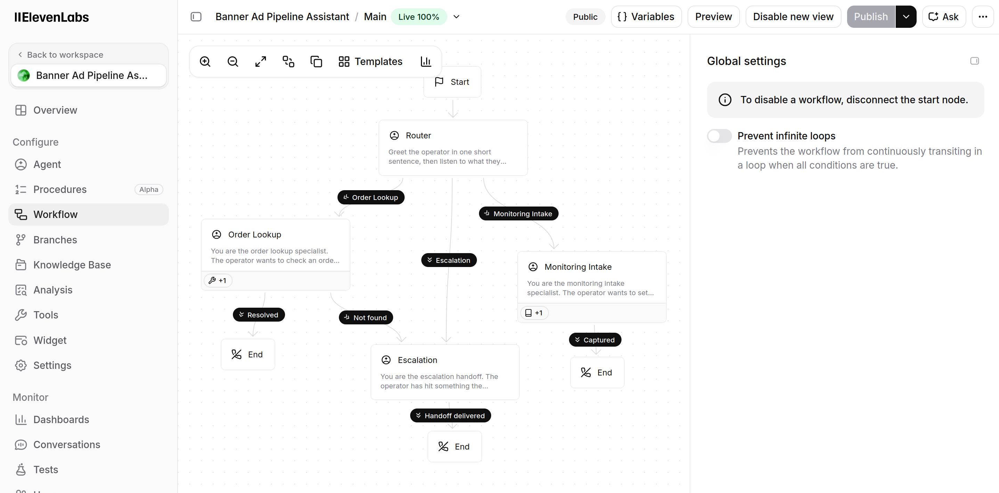
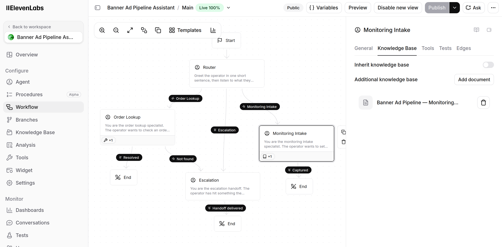
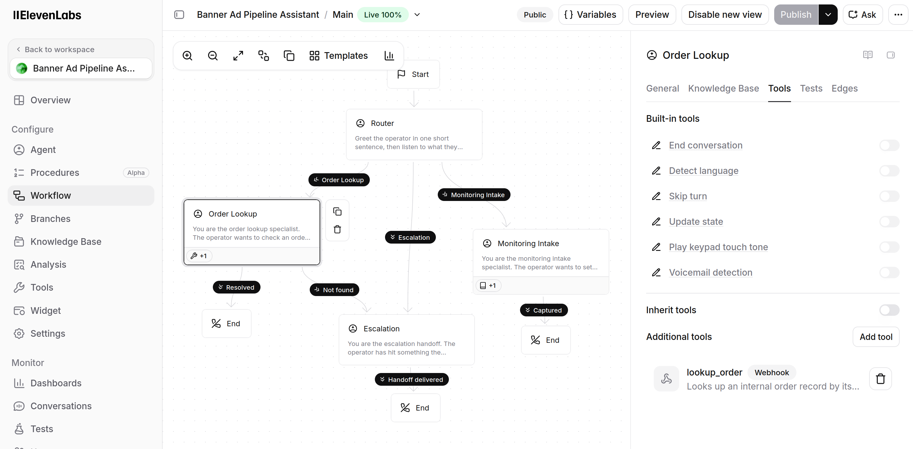
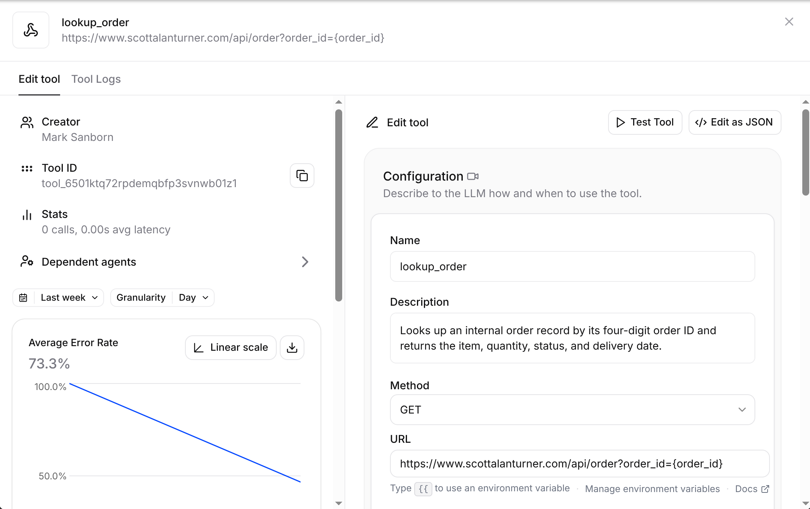
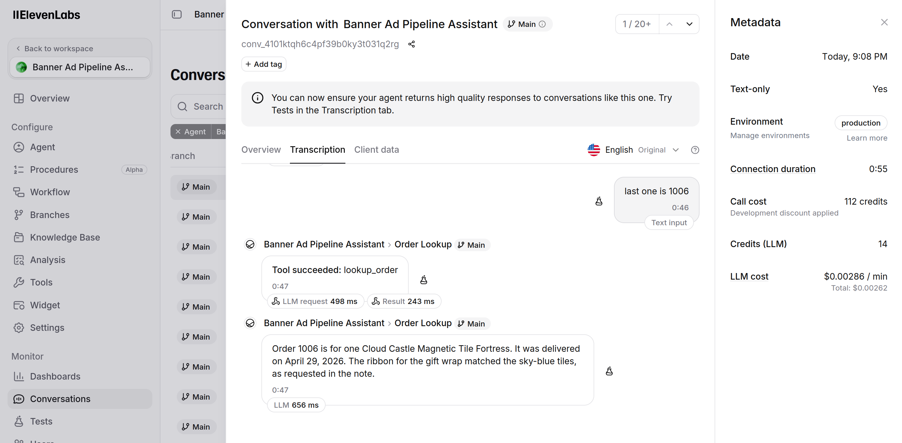

# Project 3 — Voice Agent with Branch Logic: Banner Ad Pipeline Assistant

**Live agent (share link):**
👉 https://elevenlabs.io/app/talk-to?agent_id=agent_5501ktmvcz6ee1tse18jerms842b

*Open the link, click **Call AI agent**, or use **Switch to Chat** for a text preview. No sign-in required.*

**Student:** Mark Sanborn · **Course:** ISYS 398U — Agentic AI Implementation · **Platform:** ElevenLabs (Agents / Workflow builder)

---

## Part 1 — Voice Agent Design Document

### Concept and framing

This voice agent adapts my Project 1 agent, the **Banner Ad Intelligence Agent** — the back-office engine of a competitive ad-intelligence service that extracts structured data from retailer banner-ad screenshots. That engine is inherently *visual*, so it does not port directly to a voice channel.

The **Banner Ad Pipeline Assistant** is therefore reframed as an **internal operations assistant for the Banner Ad Intelligence pipeline team** — a colleague-facing voice tool, not a customer line. An internal operator calls it to:

- **look up an order record** by ID (Branch 1),
- **set up or change a monitoring job** (Branch 2), or
- **reach a human specialist** when something is out of scope (Branch 3).

**Branch 1 is standardized by the assignment.** Every student wires the same webhook against the same test API, which returns product-order records (IDs 1001–1006). The tool and its data cannot be changed, so I keep it as a literal order-record lookup and justify it from the internal side: an operator verifying an order referenced in a capture or ticket.

### Adapted Agent Card — voice changes

Only the sections that change for voice are rewritten; the rest of the Project 1 Agent Card carries over.

**Role (also the slim system prompt, deployed verbatim):**

> You are the Banner Ad Pipeline Assistant, the internal voice assistant for the Banner Ad Intelligence pipeline team. You help operators look up order records, set up or adjust monitoring jobs, and reach a specialist when something is out of scope.
>
> Speak in short, clear, conversational sentences, and acknowledge what the operator just said before responding. Report only what's in the order record or the intake policy — never estimate, guess, infer, or offer competitive analysis. Never ask for passwords, MFA codes, or full card numbers.

*Why it changes:* the Project 1 role was written for text and reads robotically when spoken. The voice version is plain spoken English with explicit acknowledge-then-respond behavior, and is deliberately **slim** — shared role, tone, and cross-branch rules only. No routing logic or per-branch instructions live here; those live in the workflow nodes and edges.

**Task — inputs become dynamic.** Project 1 assumed the operator submits a complete request in one shot. By voice the conversation unfolds turn by turn, so the assistant greets, finds out what's needed (asking **one** clarifying question if ambiguous), routes to a branch, collects what's needed **one item at a time**, reads it back to confirm, and — if out of scope — delivers a spoken handoff and ends.

**Escalation trigger — audible handoff.** Project 1 emitted a printed string (`"Human review required…"`). The voice version is **spoken**, **names the destination by trigger**, closes the loop ("…they'll follow up if they need anything more"), and **ends the call** — there is no text artifact.

**Carried over from Project 1:** no competitive analysis / pricing recommendations / market commentary; never fabricate (specifically, never invent an order the tool did not find); ≤ 25 pages per batch without explicit confirmation; screenshots are uploaded separately (they cannot be sent by voice) — the line captures the *request*, not the images.

### The three branches

| Field | Branch 1 — Order Lookup | Branch 2 — Monitoring Intake | Branch 3 — Escalation |
|---|---|---|---|
| **Entry condition** | Operator gives an order ID, or asks to pull/verify an order record (status or contents). | Operator wants to set up, change, or ask about a banner-ad monitoring job. | Operator asks for competitive analysis / pricing recommendations / market commentary; **or** describes ad content needing regulatory-compliance judgment; **or** explicitly asks for a person; **or** the ask otherwise exceeds Branches 1 & 2. |
| **Powered by** | The `lookup_order` webhook tool | A knowledge base document — the pipeline's **Monitoring Intake & Scope Policy** | Neither — spoken handoff only |
| **Behavior** | Ask for the order ID (four-digit number). Call `lookup_order`. Read the record back conversationally (item, quantity, status, delivery date, plus gift-wrap/note if present). If no order is found, **do not invent one** — say so and route to Escalation. | Collect **retailer, page URL, run type** (scheduled weekly / on-demand) one at a time. Confirm scope from the KB (banner-ad fields only; no historical pricing / competitive analysis / non-banner content; ≤ 25-page batch). Read the request back to confirm. Never provide analysis. Out-of-scope/over-limit → Escalation. | Deliver the spoken handoff naming the destination by trigger; do not resolve it; do not read out a phone number or email. Then end the call. |
| **Exit** | Resolved (record read back) → End; or → Escalation (not found) | Resolved (request confirmed) → End; or → Escalation (out of scope / > 25 pages) | Handoff delivered → End |

**Escalation destinations (named by trigger):** out-of-scope analysis → **competitive-intelligence analyst**; regulatory-compliance case → **compliance reviewer**; explicit "I want a human" / order not found / over-limit → **operations lead**.

### Router design

The router (entry node) greets, listens, and routes — it never answers the operator's question itself.

- **First message (broad enough for all three branches):** *"Pipeline assistant. What do you need — an order lookup, a monitoring setup, or something else?"*
- **Routing logic:** order ID / order-record request → Branch 1; "add a retailer / set up a weekly scan / what can we capture" → Branch 2; competitive-analysis or pricing asks, regulatory-compliance judgment calls, or "get me a person" → Branch 3.
- **Branch-3 priority:** the escalation edge takes precedence — an out-of-scope ask, a regulatory case, or an explicit request for a human routes to Escalation even if it also touches orders or monitoring.
- **Vague input:** if the operator just says "help" or "what can you do," the router lists the three options and asks which they need rather than routing or ending.

### Workflow shape

```
                              Start
                                │
                              Router
                       (Subagent — no KB, no tool)
                ┌───────────────┼───────────────┐
         Order record       Monitoring          Out of scope /
         / order ID         setup or change      regulatory / human
                │               │                       │
          Order Lookup     Monitoring Intake        Escalation
       (Subagent + Tool)  (Subagent + KB)          (Subagent)
                │               │                       │
        Resolved → End    Captured → End      Handoff delivered → End
                │
        Not found → Escalation
```

**Isolation:** Order Lookup attaches **only** `lookup_order` (Inherit tools OFF); Monitoring Intake attaches **only** the Monitoring Intake & Scope Policy KB (Inherit knowledge base OFF). Router and Escalation have neither.

### Order Lookup tool configuration (standardized)

| Field | Value |
|---|---|
| Name | `lookup_order` |
| Method | GET |
| URL | `https://www.scottalanturner.com/api/order?order_id={order_id}` |
| Path param | `order_id` — String, LLM Prompt: "The order ID — a four-digit number the operator reads aloud, e.g. 1001." |
| Auth / Headers | none |
| Valid test IDs | 1001–1006 (invalid e.g. 9999 → must not invent an order → Escalation) |

---

## Part 4 — Test Conversations

I ran all three required branch tests plus the bonus ambiguity test against the live build (text preview, with the Adam voice applied).

### Test Conversation 1 — Branch 1 (Order Lookup)

**Branch tested:** Order Lookup

**What I said:**
- Opening: *"Hi, can you pull up an order for me?"*
- Follow-up: *"1001"*

**What the agent said:**
- *"I can certainly help with that. What is the four-digit order ID?"*
- *"I found order 1001. It's for one Galactic Hedgehog Plush (Limited), and it's currently processing. The estimated delivery date is May 23, 2026. There's a note that the plush is backordered until Tuesday, and you'll receive an email when it ships."*

- **Did it route correctly?** Yes — went straight to Order Lookup and asked for the ID.
- **Did the tool activate?** Yes. The response contained specific record fields (item name, "Limited" variant, processing status, a concrete delivery date, and a backorder note) that could only come from the `lookup_order` webhook, not general knowledge. (The call is server-side, so it doesn't appear in browser network logs, but the structured detail confirms it fired.)
- **Did the branch exit correctly?** It read back the order and held the line for follow-ups rather than ending — appropriate for a successful lookup.
- **Pass/Fail:** **Pass.** Clean routing and an accurate tool-backed read-back of the order.

### Test Conversation 2 — Branch 2 (Monitoring Intake)

**Branch tested:** Monitoring Intake (knowledge base: Monitoring Intake & Scope Policy)

**What I said:**
- Opening: *"What can the pipeline capture on a banner ad page, and can it do historical pricing?"*
- *"Great. Please set up a weekly scan for Target."*
- *"https://www.target.com/c/weekly-ad"*
- *"Yes, that's correct."*

**What the agent said (closely paraphrased):**
- *"The pipeline can capture structured data from banner ads on retailer web pages. This includes the retailer, page URL, ad position, headline, product name, offer, product category, brand, call-to-action text, promotion type, expiry date, and a confidence level for the extraction. It does not do historical pricing."*
- *"I can set up a weekly scan for Target. What is the exact URL of the page you want to monitor?"*
- *"Thanks. So, to confirm, you'd like to set up a scheduled weekly scan for Target, monitoring the page at https://www.target.com/c/weekly-ad. Is that correct?"*
- After confirmation: agent ended the chat.

- **Did it route correctly?** Yes — both the capability question and the setup request landed in Monitoring Intake.
- **Did the knowledge base activate?** Yes. The specific field list (ad position, confidence level, CTA text, promotion type, expiry date) and the explicit "does not do historical pricing" come straight from the policy document, not general knowledge.
- **Did the branch exit correctly?** Yes — collected items one at a time, captured the URL exactly, read it back to confirm, and ended on confirmation.
- **Pass/Fail:** **Pass.** Routed correctly, grounded its answer in the KB, and completed the intake-confirm-exit loop as designed.

### Test Conversation 3 — Escalation (Branch 3)

**Branch tested:** Escalation

**What I said:** *"Can you compare Walmart's banner ad pricing against Target's and tell me who's cheaper this week?"*

**What the agent said:** *"That's analyst work — the pipeline only pulls what's visibly in the ads, it doesn't compare or recommend. I've escalated this to a competitive-intelligence analyst, and they'll follow up if they need anything more. Take care."* Then the agent ended the chat.

- **Did it route correctly?** Yes — competitive-analysis request went to Escalation, taking priority over the order/monitoring branches.
- **Did it attempt to resolve it itself?** No — it explicitly declined to compare or recommend and handed off, exactly as designed.
- **Did the branch exit correctly?** Yes — delivered the closed-loop handoff and ended in a single turn.
- **Pass/Fail:** **Pass.** Correct routing, no out-of-scope answer, clean spoken handoff and exit. (I also confirmed the "ask for a human" and "order-not-found → escalate" paths both route to Branch 3 and exit correctly.)

### Bonus Test — Routing Ambiguity

**What I said:** *"Hi, I need to check on the Target campaign."* (genuinely ambiguous — "check on the Target campaign" could mean an order record or a monitoring job)

**What the agent said:** *"I can help with that. What is the order ID?"*

**Observation (no pass/fail):** The agent guessed rather than disambiguating. It defaulted to Branch 1 (Order Lookup) and asked for an order ID, even though "campaign" leans at least as much toward monitoring. A user who actually wanted to adjust a monitoring job would have to correct it. This is the weakest spot in the routing: the Router prompt handles vague "help" well, but it does not currently ask a clarifying question when an input plausibly fits two operational branches. Worth tightening if I want it to clarify instead of assume.

---

## Part 5 — Voice and Tool Failure Analysis

### 1. What changed — and what broke — moving from text to voice?

The biggest shift is that the escalation handoff and the intake read-back now have to *sound* right out loud, not just read right. The closed-loop line ("I've escalated this… they'll follow up if they need anything more. Take care.") lands cleanly as speech, but two things get riskier in voice: the order read-back contains a spoken date and a backorder note where TTS can garble numbers, and the intake step reads a full URL aloud, which is awkward and error-prone spoken character-by-character. Routing itself feels natural in text, but in voice the one-item-at-a-time intake could feel slow or mechanical if end-of-turn latency is high. The metric I'd put on a dashboard first is **confirmation compliance** — the rate at which the agent reads back the captured retailer/URL/run-type before committing — since that's the guardrail against acting on a misheard URL; I'd pair it with **end-of-turn latency** to make sure the multi-step intake doesn't feel laggy.

### 2. What happened the first time the agent tried the Order Lookup tool?

In this build the tool call succeeds on a valid ID (1001 and 1006 both returned full, correct records), so the gap was never in collecting or passing the ID — and the tool description and `{order_id}` parameter were already correct. The earlier failure was on the **unhappy path**: a not-found result (9999) initially led to a *transfer-to-self* that hung up the call instead of responding gracefully. What closed the gap was wiring the **"Not found" edge to the Escalation node** so the tool's not-found outcome is handled, combined with the **Branch 1 prompt instruction** to *decline to invent an order and hand off*. There is no "retry first" step in the build — the repeatable behavior is to acknowledge the miss and escalate; the fix was in how the workflow consumes the tool's "not found" outcome, not in the tool definition itself.

### 3. Do you trust Branch 3 after testing?

Mostly yes. It fired on every condition it should — competitive analysis, explicit human request, and order-not-found — and it consistently delivered the handoff rather than improvising an answer, then exited cleanly. Importantly, it doesn't over-fire, and the truthful version of that point distinguishes two cases: a **mis-heard or incomplete ID** makes the agent re-ask for the number (clarification, not escalation), which is the real "doesn't over-fire" behavior; a **not-found real ID like 9999** is correctly *not* invented — the agent escalates and ends, exactly as designed. If I heard the handoff spoken to a colleague it would sound professional and clear. The one thing I'd change is the closing phrase "Take care" — it's warm but slightly casual for an internal-ops handoff; I'd tighten it to something like "Thanks for flagging it" to better match an operations register.

> **Known polish item (observed, not yet changed):** on the not-found path the line actually spoken is the Order Lookup node's shorter "I'll transfer you to a specialist," because the Escalation node does not always speak when entered immediately after a tool call. Aligning the Order Lookup not-found wording to the Escalation node's closed-loop register would give one consistent handoff style regardless of entry path.

---

## Screenshots

**Workflow canvas — router, three branch subagents, labeled edges, and End nodes:**



**Branch 2 (Monitoring Intake) — Knowledge Base tab with the policy document attached:**



**Order Lookup — Tools tab showing `lookup_order` attached (Inherit tools OFF):**



**`lookup_order` tool configuration panel (URL, parameter, description):**



**Successful tool call — agent reporting an order's contents during a test conversation:**


